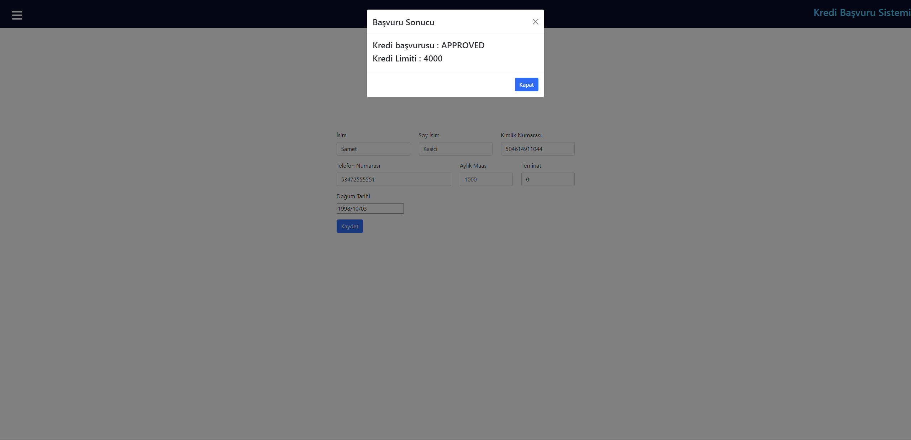
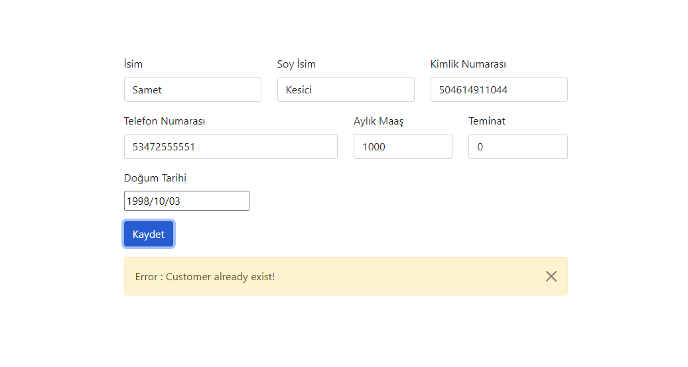
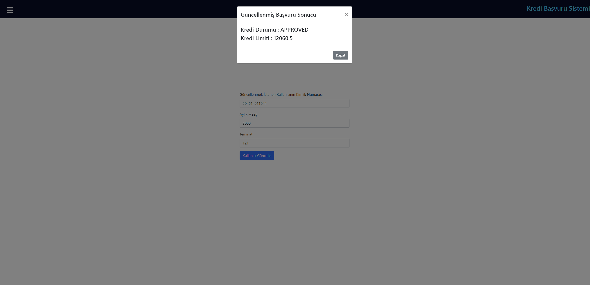
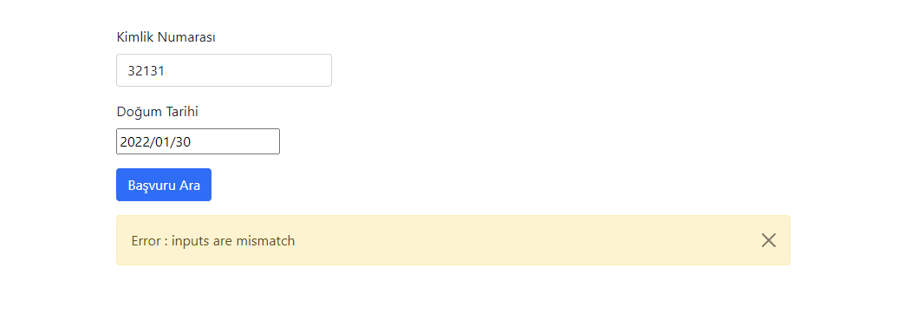

1. [How To Run](#htr)
   1. [Docker](#docker-how)
   2. [Local](#local)
2. [Liquibase](#liquibase)
3. [Logging](#logging)
4. [Design Pattern](#designpattern)
5. [Docker](#docker)
6. [Swagger](#swagger)
7. [Unit Tests](#tests)
8. [Screenshots](#screenshots)

## How To Run 

### Running as docker container 

    cd creditapplication-backend/compose && docker-compose up
    client,db and backend will start working together.

    backend : localhost:8080
    client : localhost:3000
    db : localhost:5432

### Locally 

    cd compose && docker-compose up postgresqldb
    change application.yaml file for db connection ( url: jdbc:postgresql://localhost:5432/creditapplication )
    change creditapplication-client -> package.json -> proxy ( "proxy": "http://localhost:8080" )
    Build project

## Liquibase 

I have used **Liquibase** for managing database tables, sequences and default data. It will create all stuff on first run

## Logging 

Logging configuration is located in the resource folder file named logback-spring.xml.Logs are saved in a folder named logs in the main directory.

## Design Pattern 

Strategy Design Pattern using for credit limit calculation. You can find it in the service package with the name strategy.

## Docker 

Application only needs postgres to run and you can run it from docker-compose also application is dockerized you can find steps at the top of the page

## Swagger 

Swagger url = localhost:8080/swagger-ui.html

## Unit Tests 

I have tried to write unit tests for business code. I have used JUni5 with Mockito

## Screenshots 

